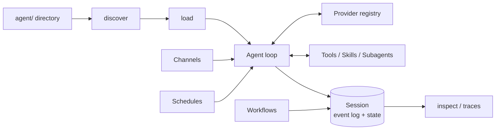

# Architecture

> **TL;DR**
> A small composable core: discovery finds files, loading validates them, the
> agent loop turns model calls into events, and everything durable is a
> projection of an append-only log. Each concern is one module with one
> interface, so each can be replaced without touching the others.

## The shape

## Module boundaries

| Module | Owns | Knows nothing about |
| ------ | ---- | ------------------- |
| `project/` | Filesystem conventions, discovery, loading | Models, sessions |
| `tools/`, `skills/`, `subagents/` | Definitions and registries | Providers, storage |
| `providers/` | Wire formats for each backend | The loop, the filesystem |
| `runtime/` | Event log, session replay, store interface, sandbox | Providers, CLI |
| `agent/` | The loop: model ↔ tools ↔ events | Wire formats, storage layout |
| `workflows/`, `channels/`, `schedules/` | Their own contract, driven by the loop | Each other |
| `cli/` | Argument parsing and presentation only | — (delegates everything) |

The dependency direction is strictly inward: CLI → agent → (project, providers,
runtime) → shared types. No module imports the CLI.

## Decisions

### The filesystem is the interface
Directories and files are the API most people already know. Discovery is
separated from loading so a project can be *described* even when a file fails
to *import* — errors point at one file, not at "the config".

### Events, then everything else
The transcript, pending approvals, workflow progress, traces, and session
status are all projections of one append-only JSONL log. This single decision
buys crash recovery, resumable human-in-the-loop, and observability without
separate subsystems for each — and makes "what did the agent do?" answerable
with `cat` and `jq`.

### Provider-agnostic message shape
The runtime's `text` / `tool_call` / `tool_result` parts are serializable and
neutral; providers translate at the edge. Transcripts persisted today replay
against a different provider tomorrow.

### Approval as a durable pause, not a callback
`approval: true` writes an event and ends the run with `waiting_approval`.
There is no in-memory continuation to lose: approving is just "execute the
recorded call, append the result, run the loop again", which works across
process restarts and even across machines sharing the store.

### One level of subagents
A subagent is a tool that runs a child session. Deeper nesting is deliberately
unsupported: it multiplies cost and failure modes faster than capability, and
the composition that matters (specialist + private tools + cheaper model) is
fully available at depth one.

### Small dependency surface
One runtime dependency (`zod`, which is also the user-facing schema language).
HTTP is `fetch`; the server is `node:http`; cron, ids, and logging are ~100
lines each. Fewer moving parts is a durability feature.

## Extension points

| To add… | Implement… |
| ------- | ---------- |
| A model backend | `Provider` (one `generate`, optional `stream`). |
| A storage backend | `SessionStore` (5 methods) → `defineAgent({ store })`. |
| An integration | `defineChannel` in `agent/channels/`. |
| A platform adapter | Wrap the `dist-deploy` bundle + a `SessionStore`. |

## Known trade-offs

- **Streaming** is interface-complete but the built-in providers emit chunks
  after completion rather than token-by-token SSE.
- **File store concurrency** assumes one writer per session; multi-instance
  deployments need session sharding or a locking store.
- **Sandboxing** is process isolation (env scrubbing, crash containment,
  timeouts), not a security boundary against malicious code — use containers
  for untrusted tool code.

These are recorded, not hidden; each has a stable interface behind which the
implementation can improve.
